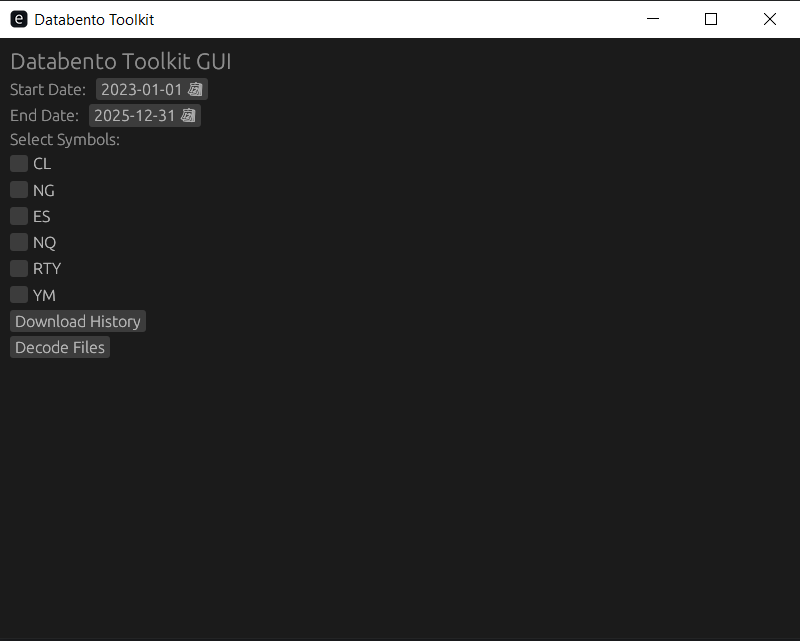

# Databento Toolkit (Unofficial)

### Supported Futures Contracts: CL, ~~NG~~, ES, NQ, RTY, YM

This project provides tools for downloading, decoding, and processing historical market data using the [Databento API](https://docs.databento.com/) and the Rust Programming Language.

It supports downloading 1-minute bar data (OHLCV) for 6 futures contract symbols:   
CL (crude oil)  
~~NG (natural gas)~~ Issue found, do not use unless you can fix it yourself (time window)  
ES (S&P 500 index)  
NQ (Nasdaq futures)  
RTY (Russell 2000 index)  
YM (Dow Jones index).

- **Energy contracts:** Downloads the last 40 days for the front-month contract (e.g., CL, NG).
- **Index contracts:** Maintains a 10-day overlap between quarterly expirations (e.g., ES, NQ).

Now includes a **Graphical User Interface (GUI)** built using `egui`, enabling easier usage without running CLI commands.


- This is an independent project by Aleksandr Strizhevskiy, and is not supported by Databento

- Built with JetBrain's RustRover IDE (and ChatGPT {I promise I tested it} ) 
---


---


## Features

1. **Graphical User Interface**
   - Options to trigger downloads and decode operations directly from the GUI.
   - Estimate expected download cost before starting a download.
   - Select start and end dates. The system handles:
      - Determining contract expiration
      - Breaking downloads into sets of front of the month contracts
      - Ensures 10-day overlap between contracts (to fine-tune rollover strategies for your backtesting)
      - Sorting downloads into folders for each symbol


2. **Download Data**
   - Fetch historical market data from the Databento API.
   - Supports crude oil, natural gas, and index futures contracts.
   - Downloads are optimized with concurrency-control


3. **Decode Data**
   - Decodes Databento's `.dbn.zst` compressed file format into JSON for further analysis.
   - Processes downloaded files in bulk and outputs decoded files into the same folder structure.


4. **Request a Quote (API Cost Estimation)**
   - Available via CLI `quote` subcommand.
   - Calculate the estimated cost of fetching historical data based on:
      - Symbol, date range, and schema (e.g., OHLCV with 1-minute granularity).
   - Prevents unnecessary API costs by previewing charges before initiating downloads.

---

## Known Issues

- `NG` (Natural Gas) contract estimation logic is currently broken for some contract windows and can return API resolution errors.
- Because the estimator and downloader share contract-window generation, `NG` downloads are likely affected by the same issue.
- `CL`, `ES`, `NQ`, `RTY`, and `YM` are currently more reliable than `NG`.
---

## Prerequisites & Setup

Before using this toolkit, ensure you have the following:

1. **Rust Development Environment**
    - Install Rust from [rust-lang.org](https://www.rust-lang.org/).
    - Use version `1.88.0` or later.


2. **Databento Account**
    - Create an account at [Databento](https://www.databento.com/) and obtain an API key.
    - Copy (or rename) the example environment file `.env.example`  to `.env`.
    - Add the API key to your `.env` file.


3. **Dependencies**
   The project depends on several Rust libraries, specified in the `Cargo.toml`:
    - [`databento`](https://crates.io/crates/databento)
    - [`tokio`](https://tokio.rs/) for async runtime and concurrency.
    - [`serde`](https://serde.rs/) and [`serde_json`](https://crates.io/crates/serde_json) for deserialization.
    - [`dotenvy`](https://docs.rs/dotenvy) for loading environment variables.

---


## How to Use (OLD - Now just use GUI)

### 1. **Download Historical Data**

This project was written with RustRover, so instructions will be for that IDE.

To download historical data, go into `Run/Debug Configurations` in the IDE's Run Settings and append `-- download` to Command.
The full path should look like this:

`run --package databento_toolkit --bin databento_toolkit -- download`

Alternatively, you can run the project from the terminal as such:
```shell script
cargo run --package databento_toolkit --bin databento_toolkit -- download
```

Currently, downloads crude oil CL contract data for a specified set of years.

You can customize the base folder where downloads are saved by editing the `base_path` variable in `main.rs`.

- **Default Download Folder:** `Hist_Fut_Data/`
- Each dataset is organized into subfolders based on the year.

---

### 2. **Decode Files**

After downloading, you’ll need to decode the `.dbn.zst` files into a readable format. 
Use the `decode` task to convert the downloaded data.

The decode task reads files in the `Hist_Fut_Data/` directory, decodes them, and saves them as JSON.

---

### 3. **Get a Quote (API Cost Estimation)**

Use the `quote` subcommand to estimate cost before downloading.

Example:
```shell script
cargo run -- quote --start 2023-06-01 --end 2023-06-30 --symbol CLN3 --dataset GLBX.MDP3
```

Required:
- `--start YYYY-MM-DD`
- `--end YYYY-MM-DD`

Optional:
- `--symbol` (default `CLN3`)
- `--dataset` (default `GLBX.MDP3`)

Current schema for quote requests is `Ohlcv1M`.

### **Note**:
It cost $3.21 to download 24 months (24 contracts 40 days each) of CL futures data in 1-minute bars (this is the code as written now).  
You may optimize it further to download even fewer bars, further reducing costs.  
Costs seem to vary from contract to contract and month to month.

---


### Code Overview

The project is organized into modular files to separate concerns:

#### 1. `client.rs`
Handles API client creation and wraps the Databento `HistoricalClient` with simplified setup using environment variables.

#### 2. `types.rs`
Defines core data structures, including:
- `DownloadTask`: Encapsulates metadata for each download operation.
- `JsonOhlcv`: A deserializable representation of OHLCV data for usage after decoding.

#### 3. `download.rs`
Main logic for downloading data:
- Generates CL contracts using CME rules for expiration dates.
- Uses asynchronous tasks to fetch and save historical data files.
- Employs a `tokio::sync::Semaphore` to limit concurrent API calls.

#### 4. `contracts.rs`
Defines CME rules for generating contract symbols (e.g., `CLN3`) and their expiration periods (only CL for now):
- Maps months of the year to futures month codes.
- Calculates download start and end dates for each contract.

#### 5. `fetch.rs`
Handles the actual download of data using the Databento API client for the generated contract periods.

#### 6. `decode.rs`
Processes `.dbn.zst` files from the download directory and decodes them into JSON.

#### 7. `get_quote.rs`
Returns the estimated cost of a history download request from Databento.

---

## Customization Notes
(Needs updating)

---

## Example Workflow (Old)

1. **Download the Data:**
   Run the `download` task to fetch `.dbn.zst` datasets:
```shell script
cargo run --package databento_toolkit --bin databento_toolkit -- download
```


2. **Verify Files:**
   Downloaded files are saved in `Hist_Fut_Data/<year>/<symbol>.dbn.zst`. Example:
```
Hist_Fut_Data/2023/CLN3.dbn.zst
```


3. **Decode Files:**
   Use the `decode` task:
```shell script
cargo run --package databento_toolkit --bin databento_toolkit -- decode
```
Decoded files are saved in the same directory (`Hist_Fut_Data`).

---

## Future Enhancements

- **More Symbols:**
    Support for metals and forex futures.
- **Pretty Print Option:**
    Currently, decoded times are in Unix time and prices are in integers with no decimals.
- **Improved User Interface:** Low priority 
- **Other Data Sets:**
    Databento gives to option to download data from different sources in many different formats (including tick data).  
    Very Low priority.

---

## Troubleshooting

- Honestly, just ask ChatGPT
